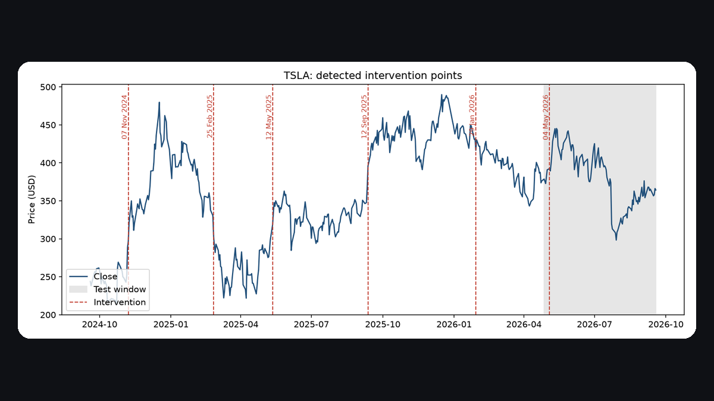
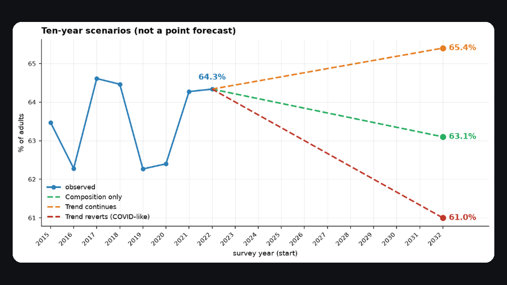
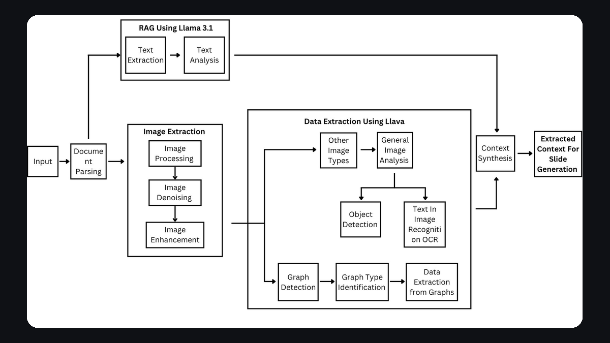
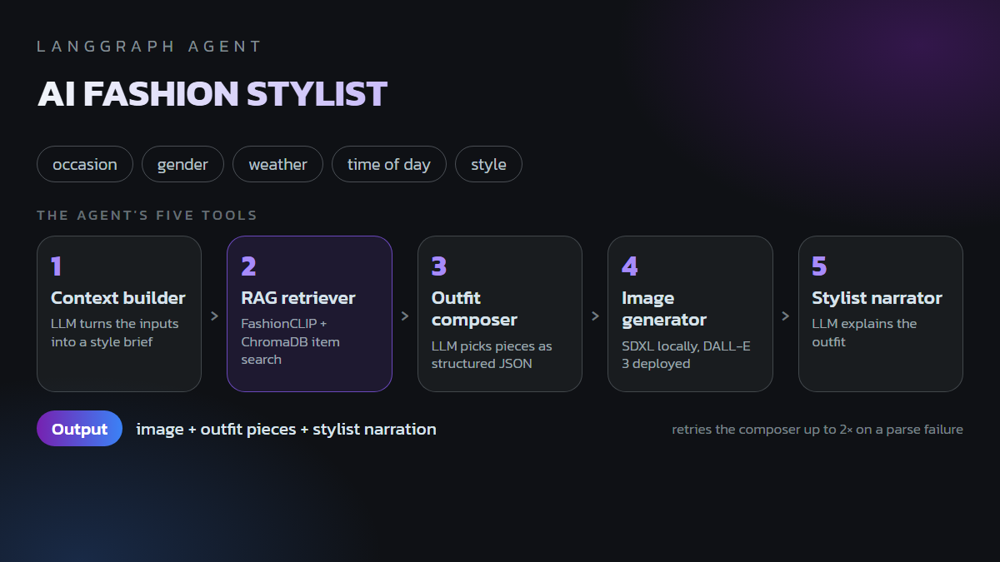
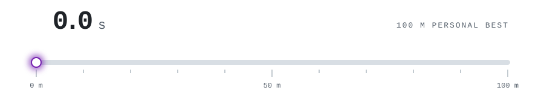

<picture>
  <source media="(prefers-color-scheme: dark)" srcset="assets/banner-dark.png">
  
</picture>

I make models that predict things, and I spend most of my time checking they actually do.

I'm a data scientist in London, finishing an MSc in Data Science at the University of Bristol. Most of my work is forecasting, machine learning and the data pipelines behind them.

## Things I've built

<table>
  <tr>
    <td width="50%" valign="top">
      
       <b><a href="https://github.com/YashPandloskar/Intervention-Analysis">Intervention-Analysis</a></b>
       Does telling a forecaster about sudden price shifts make its forecasts better? Six models on Tesla and IBM prices, with and without. It helped Prophet, it didn't help the neural networks, and nothing clearly beat predicting yesterday's close.
    </td>
    <td width="50%" valign="top">
      
       <b><a href="https://github.com/ss25231/London-Time-Series-Forecasting-Patterns">Forecasting physical activity in London</a></b>
       A team project forecasting sport and physical activity across the 32 London boroughs from eight years of survey data. It beat a persistence baseline, 2.74 vs 3.44 points of error. The repository is on a teammate's account.
    </td>
  </tr>
  <tr>
    <td width="50%" valign="top">
      
       <b><a href="https://github.com/YashPandloskar/Automated-Slides-Generation">Automated-Slides-Generation</a></b>
       Turns a scientific PDF into a PowerPoint deck on your own machine, using Llama 3.1 for the text and LLaVA for the figures.
    </td>
    <td width="50%" valign="top">
      
       <b><a href="https://github.com/YashPandloskar/fashion-stylist-agent">fashion-stylist-agent</a></b>
       An agent that suggests outfits for an occasion, the weather and the time of day, built with LangGraph, FashionCLIP retrieval and generated outfit images.
    </td>
  </tr>
</table>

## What I work with

<picture>
  <source media="(prefers-color-scheme: dark)" srcset="assets/stack-dark.svg">
  
</picture>

## Off the keyboard

I also sprint: the 100m and 200m for Maharashtra at national level, with a 10.8 second personal best.

<picture>
  <source media="(prefers-color-scheme: dark)" srcset="assets/race-dark.svg">
  
</picture>

## Elsewhere

[Portfolio](https://yash-pandloskar-portfolio.vercel.app) · [LinkedIn](https://www.linkedin.com/in/yashpandloskar)
